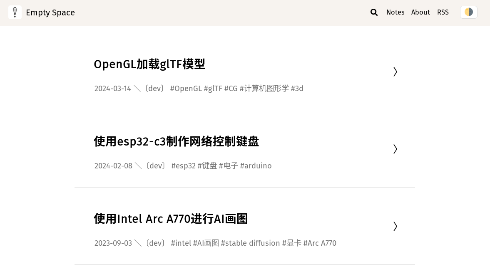
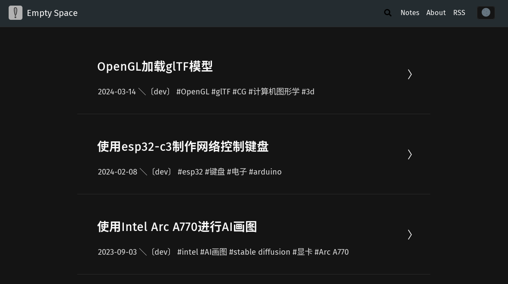

# sushi-theme-empty
Theme written for sushi. Intended for Linux users. Tested on Arch Linux.

- [Example (my blog)](https://nth233.top)

## dependencies

1. pandoc
2. python package: pandocfilters and pygments
3. typst (if you need to render `.typ` files to pdf)

This theme requires ssushi version >= 0.2.10

## some pandoc filters

- `pandoc-katex` is from https://github.com/xu-cheng/pandoc-katex for serverside katex rendering
- `pandocfilter-pygments.py` is from https://github.com/DoomHammer/pandocfilter-pygments for better code highlight

If you don't need these filters, you can just simply delete them, and remove them from converter.sh
